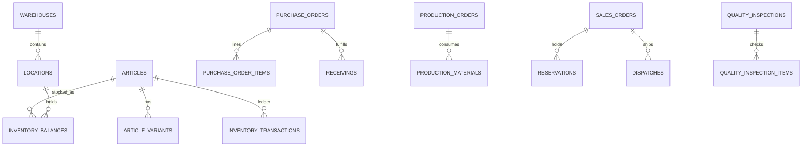

# 06 — Database ERD (Logical)

## Identity & access

```text
users ──< user_roles >── roles ──< role_permissions >── permissions
users ──< audit_logs
users ──< approvals (requested_by / decided_by)
```

## Master data

```text
categories (self-FK parent_id)
units
suppliers
articles ──< article_variants
articles >── categories
articles >── units
articles >── suppliers (optional default)
article_images / barcodes on article or variant
```

## Warehouse topology

```text
warehouses
  └── warehouse_zones
        └── locations  (type: RACK | SHELF | BIN | OTHER; parent_id for hierarchy)
```

Prefer a single `locations` table with `parent_id` + `level` for flexibility (Zone/Rack/Shelf/Bin), scoped by `warehouse_id`.

## Inventory core

```text
inventory_balances
  (article_id, variant_id?, warehouse_id, location_id?, status, qty, version)
  UNIQUE (article_id, variant_id, warehouse_id, location_id, status)

inventory_transactions
  (id, type, article_id, variant_id?, warehouse_id, location_id?,
   from_status, to_status, qty, balance_after,
   unit_cost?, reference_type, reference_id,
   performed_by, reason, created_at)
```

Balances are projections; transactions are source of truth for history.

## Purchasing

```text
suppliers ──< purchase_orders ──< purchase_order_items
purchase_orders ──< receivings ──< receiving_items
receiving_items → may create quality_inspections
```

## Production

```text
bom ──< bom_items (component article/variant + qty)
production_orders ──< production_materials
production_orders → inventory consume / produce transactions
```

## Sorting & QC

```text
sorting_orders ──< sorting_items
quality_inspections ──< quality_inspection_items
  (polymorphic source: receiving | production | sorting | return)
```

## Fulfillment

```text
customers ──< sales_orders ──< sales_order_items
sales_orders ──< reservations
sales_orders ──< picking_orders ──< picking_items
sales_orders ──< packing_orders ──< packing_items / packages
sales_orders ──< dispatches ──< dispatch_items
sales_orders ──< returns ──< return_items
```

## Warehouse movements

```text
transfers ──< transfer_items
stock_adjustments ──< stock_adjustment_items
stock_counts ──< stock_count_items → may spawn adjustments
```

## Cross-cutting

```text
notifications
attachments (polymorphic entity)
system_settings
document_sequences (numbering)
inventory_statuses (configurable)
notification_rules
```

## Mermaid (high-level)



Detailed column definitions: [07-database-schema.md](07-database-schema.md).
